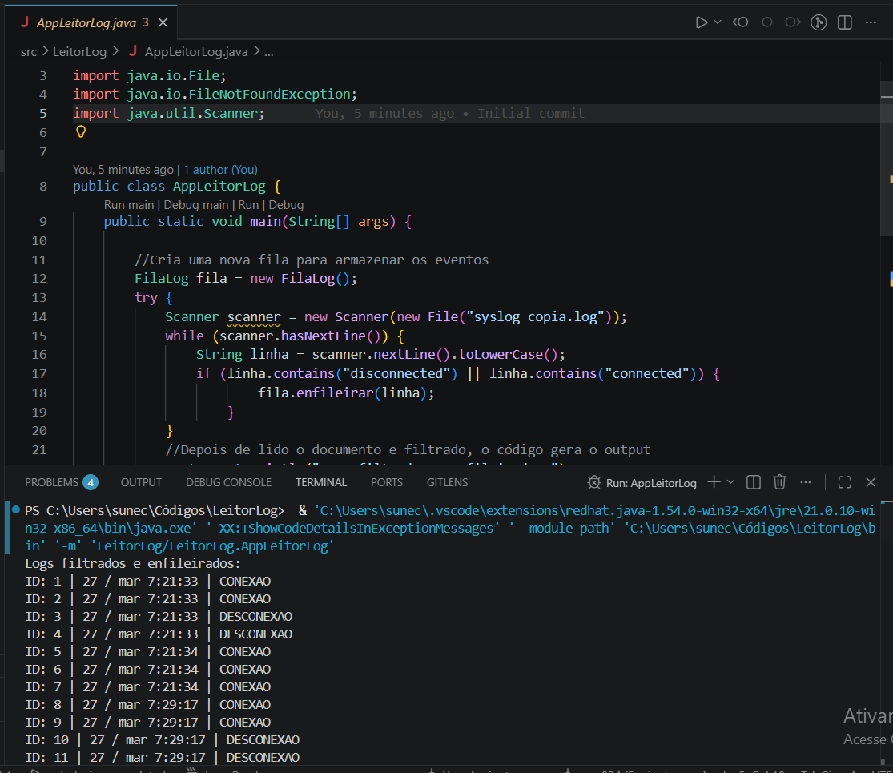

Java Log Reader

Projeto em Java para leitura e organização de logs utilizando estruturas de dados.

Tecnologias
- Java
- Programação Orientada a Objetos
- Estrutura de Dados

Funcionalidades
- Leitura de arquivos de log
- Organização de eventos
- Estrutura de fila personalizada
- Processamento de registros

Objetivo
Projeto criado para praticar:
- manipulação de arquivos
- filas encadeadas
- organização de código
- lógica de programação

Como executar

```bash
javac *.java
java AppLeitorLog


